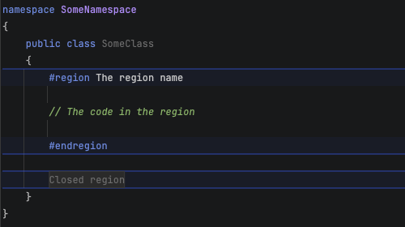
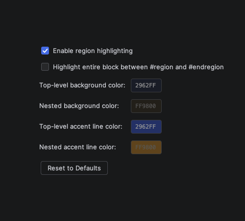

# Region Highlights

Coloring #region lines to make them easier to see in Rider. You might start to love Regions with this feature.

## Screenshots

Highlights #region/#endregion blocks in C# files with background colors and accent lines.

Nested regions are rendered in a different color.

Fully customizable colors and accent lines.

